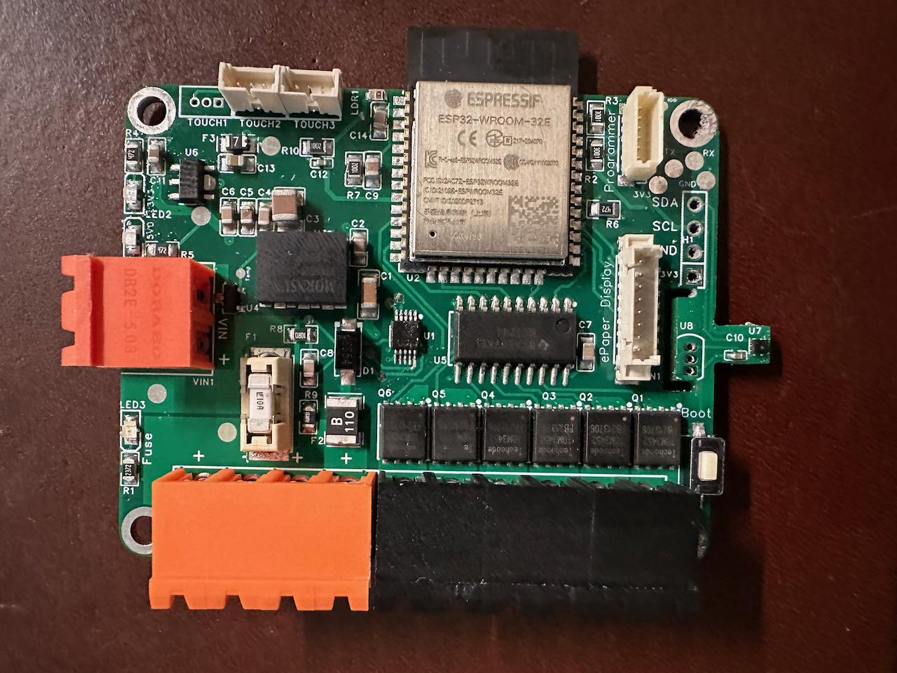
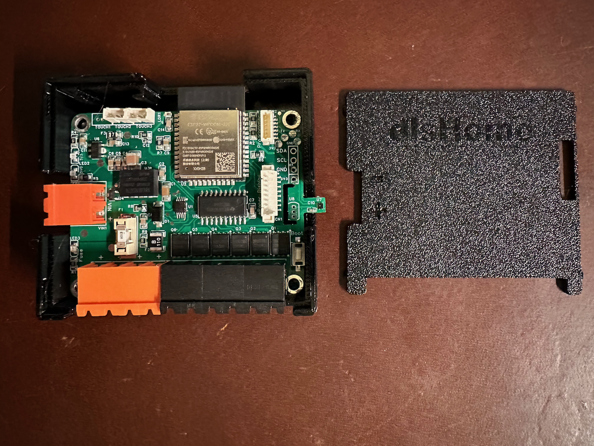

# aLed Controller

  

aLed Controller is an analog leds controller for the smart home. It was designed to run with Home Assistant using ESPHome and features:

-  Six analog channels. (Can run a single CCTRGB or RGBW strip, up to two RGB strips, up to three CCT strips, or up to six single color strips with a high current and high PWM frequencies).
- Based on ESP32-WROOM-32.
- Runs EPSHome (or you can flash it with whatever firmware makes you happy)
- Changeable fuse
- [Optional] INA226 sensor (a current shunt and power monitor).
- [Optional] Ambient light sensor.
- [Optional] PCB temperature sensor (can be handy if you plan to run a high power load).
- [Optional] SHT40 temperature and humidity sensor.
- [Optional] DS18B20 temperature sensor (cheaper, easier to get hold of, and solder compared to SHT40).
- [Optional] Outputs for up to 3 external buttons.
- [Optional] I2C bus output for plugging an external sensor.
- [Optional] Connector for ePaper display.

The controller works with 5-24v input. Positive output lines are protected by a replaceable fuse.

## PCB ordering

If you want to support the project, you can order PCB manufacturing and/or assembly on PCBWay

- [PCBWay Order](https://www.pcbway.com/project/shareproject/aLed_Controller_v2_4e3c079f.html) - they do quite necelly. Please keep in mind that stencil will be very handy. 

## Enclosure

3D printed enclosure is available for the PCB. STL files can be found [here](https://github.com/dlsnet/aLed-Controller/tree/main/resources/Case%20STL)

